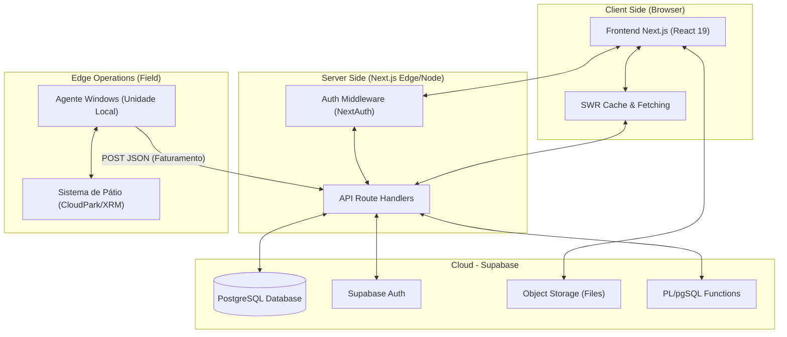

# Arquitetura do Sistema: Leve ERP (PRISM)

## 1. Stack Tecnológica Completa

O Leve ERP é construído sobre uma arquitetura moderna de **Single Page Application (SPA)** com renderização híbrida (Server-Side e Client-Side) utilizando o ecossistema Next.js e Supabase.

*   **Frontend Framework:** Next.js 16.1.6 (App Router) com React 19.
*   **Linguagem:** TypeScript 5.x.
*   **Estilização:** Tailwind CSS (Vanilla CSS para componentes Antigravity complexos).
*   **Backend as a Service (BaaS):** Supabase.
    *   **Banco de Dados:** PostgreSQL 15+ (Gerenciado).
    *   **Autenticação:** NextAuth.js v5 (Auth.js) integrado ao Supabase Auth.
    *   **Storage:** Supabase Storage para anexos de sinistros e documentos.
    *   **Lógica de Banco:** Remote Procedure Calls (RPC) em PL/pgSQL para consolidação financeira.
*   **Principais Bibliotecas:**
    *   `lucide-react`: Iconografia.
    *   `recharts`: Dashboards e visualização de dados.
    *   `swr`: Fetching de dados com cache no client-side.
    *   `bcryptjs`: Hashing de segurança.
    *   `googleapis`: Integrações com serviços externos.

## 2. Arquitetura Geral

O diagrama abaixo descreve o fluxo de dados entre o frontend, o backend (Next.js), o BaaS (Supabase) e os agentes externos.



## 3. Agente Windows — Arquitetura Detalhada

O **Agente Windows** é um serviço leve desenvolvido em Python ou C# que reside nas máquinas locais de cada unidade de estacionamento.

*   **Função:** Atua como um "Bridge" (ponte) entre o software de gestão local (que muitas vezes roda offline ou em rede local) e o ERP em nuvem.
*   **Coleta de Dados:** O agente consulta o banco de dados local (SQL Server, Firebird ou SQLite) dos sistemas de pátio em intervalos regulares (geralmente a cada 15-30 minutos).
*   **Dados Coletados:**
    *   Tickets avulsos pagos.
    *   Recebimentos de mensalistas.
    *   Eventos e convênios.
    *   Logs de abertura/fechamento de caixa.
*   **Método de Envio:** Push via HTTP POST para o endpoint `/api/integracoes/cloudpark/receber-movimentos`.
*   **Segurança:** Payload assinado com um `Bearer Token` exclusivo por unidade (`CLOUDPARK_API_TOKEN`).
*   **Resiliência:** O agente possui um mecanismo de **"Snapshot & Retry"**. Caso a internet da unidade caia, ele armazena os movimentos localmente e realiza o upload em massa assim que a conexão é restaurada, utilizando o campo `integracao_hash` para garantir que nenhum dado seja duplicado no servidor.

## 4. Estrutura de Pastas do Projeto

```text
src/
├── app/                    # Next.js App Router
│   ├── (auth)/             # Rotas de Login e Recuperação
│   ├── (dashboard)/        # Área logada protegida por middleware
│   │   ├── admin/          # Módulos Administrativos (Usuários, TI, IA)
│   │   ├── faturamento/    # Dashboards Financeiros e Metas
│   │   ├── patrimonio/     # Gestão de Ativos
│   │   └── operacoes/      # Gestão de Unidades e Sinistros
│   └── api/                # Route Handlers (Backend)
│       └── integracoes/    # Webhooks e Recebimento de dados (Agentes)
├── components/             # Componentes React Reutilizáveis
│   ├── ui/                 # Componentes Atômicos (Botões, Inputs)
│   └── layout/             # Sidebar, Navbar, Page Containers
├── lib/                    # Utilitários e Clientes
│   ├── supabase/           # Configuração supabase (Client vs Server)
│   └── auth.ts             # Configuração NextAuth
└── types/                  # Definições de Interfaces TypeScript
```

## 5. Padrões de Desenvolvimento

*   **Componentes:** Seguem o padrão funcional com hooks. Styles são aplicados via Tailwind ou CSS-in-JS (Style JSX) para efeitos Antigravity (glassmorphism).
*   **Gerenciamento de Estado:**
    *   **Server State:** Gerenciado pelo **SWR** (Stale-While-Revalidate) para garantir que os dados estejam sempre atualizados sem reloads de página.
    *   **UI State:** Hooks `useState` e `useContext` nativos do React.
*   **Acesso ao Banco:**
    *   **Client-Side:** O uso do Supabase client é restrito a operações de leitura simples.
    *   **Server-Side:** Operações críticas de escrita utilizam o `AdminClient` dentro de API Routes para garantir validação de tokens e hashing de segurança.
*   **Nomenclatura:**
    *   Tabelas: `snake_case` (ex: `faturamento_movimentos`).
    *   Componentes e Pastas: `kebab-case` ou `PascalCase`.

## 6. Ambientes e Deploy

*   **Desenvolvimento:** Ambiente local via `npm run dev` conectado ao projeto `development` no Supabase.
*   **Produção:** Deploy automatizado via **Vercel** ou infraestrutura similar, conectado ao projeto `production` do Supabase.
*   **Variáveis de Ambiente:**
    *   `NEXT_PUBLIC_SUPABASE_URL` / `NEXT_PUBLIC_SUPABASE_ANON_KEY`
    *   `SUPABASE_SERVICE_ROLE_KEY` (Apenas servidor)
    *   `AUTH_SECRET` (NextAuth)
    *   `CLOUDPARK_API_TOKEN` (Validação de Agentes)
*   **Pipeline:** Cada `git push` para o branch `main` dispara um build automático com linting e type-check antes do deploy final.