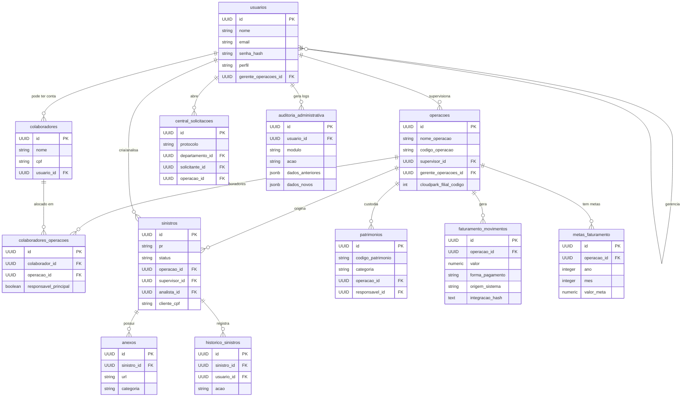

# Banco de Dados: Leve ERP (PRISM)

## 1. Visão Geral do Banco

### Organização
O banco de dados é 100% gerenciado pelo **Supabase** (PostgreSQL 15+). As tabelas são organizadas por domínio de negócio, com prefixos de módulo para agrupamento lógico.

| Prefixo de Tabela | Módulo |
|---|---|
| `usuarios`, `perfis_*`, `configuracoes_*` | Core / IAM |
| `operacoes`, `colaboradores*` | Operações |
| `sinistros`, `anexos`, `historico_sinistros`, `inconsistencias` | Sinistros |
| `solicitacoes_tarifario`, `tarifarios_*` | Tarifários |
| `faturamento_*`, `metas_faturamento*`, `apuracoes_meta*`, `alertas_meta*` | Financeiro / Faturamento |
| `patrimonios`, `patrimonio_*` | Patrimônio |
| `central_*` | Central de Solicitações (Helpdesk) |
| `auditoria_administrativa` | Auditoria Global |
| `control_xrm_logs` | Integrações Externas |

### Convenção de Nomenclatura
- **Tabelas:** `snake_case`, plural (ex: `faturamento_movimentos`).
- **Colunas:** `snake_case` (ex: `data_ocorrencia`).
- **PKs:** Sempre `id UUID` com `DEFAULT uuid_generate_v4()`.
- **FKs:** Nomeadas como `<entidade>_id` (ex: `operacao_id`, `usuario_id`).
- **Timestamps:** `criado_em TIMESTAMPTZ` e `atualizado_em TIMESTAMPTZ` em toda tabela com escrita.
- **Triggers:** `trg_<tabela>_atualizado_em` + `trg_audit_<tabela>`.

### Estratégia de RLS
O Leve ERP adota uma abordagem **híbrida** de segurança:
1. **Autenticação:** Gerenciada pelo NextAuth (JWT), com o `user_id` injetado no contexto `SET LOCAL audit.current_user_id` a cada requisição no servidor.
2. **RLS via Funções Auxiliares:** As funções `fn_get_current_user_id()` e `fn_get_current_user_perfil()` são o coração do RLS, lendo tanto o `auth.uid()` nativo do Supabase quanto o `audit.current_user_id` do contexto da sessão NextAuth.
3. **Service Role nas APIs:** A maioria das operações críticas passa pelo `createAdminClient()` no backend Next.js (que usa a `SUPABASE_SERVICE_ROLE_KEY`), com autorização validada em camada de aplicação antes de chamar o banco.

---

## 2. Mapa de Tabelas por Módulo

### Módulo Core — IAM e Configurações

#### `usuarios`
Cadastro mestre de todos os usuários do sistema. **Dados sensíveis.**

| Coluna | Tipo | Nullable | Default | Descrição |
|---|---|---|---|---|
| `id` | UUID | NOT NULL | `uuid_generate_v4()` | PK |
| `nome` | VARCHAR(255) | NOT NULL | — | Nome completo |
| `email` | VARCHAR(255) | NOT NULL | — | Email único de acesso |
| `senha_hash` | VARCHAR(255) | NOT NULL | — | Hash bcrypt da senha |
| `perfil` | ENUM `perfil_usuario` | NOT NULL | `'supervisor'` | Role de acesso |
| `telefone` | VARCHAR(20) | NULL | — | Contato |
| `status` | ENUM `status_usuario` | NOT NULL | `'ativo'` | Estado da conta |
| `ativo` | BOOLEAN | NOT NULL | `TRUE` | Deleção lógica |
| `gerente_operacoes_id` | UUID (FK `usuarios`) | NULL | — | Self-referential para hierarquia |
| `criado_em` | TIMESTAMPTZ | NOT NULL | `NOW()` | — |
| `atualizado_em` | TIMESTAMPTZ | NOT NULL | `NOW()` | Auto-atualizado por trigger |

**Índices:** `idx_usuarios_perfil`, `idx_usuarios_gerente`, `idx_usuarios_email`

**ENUMs de `perfil_usuario`:** `administrador`, `diretoria`, `gerente_operacoes`, `supervisor`, `analista_sinistro`, `financeiro`, `rh`, `dp`, `auditoria`, `ti`, `administrativo`

---

### Módulo Operações

#### `operacoes`
Cadastro de todas as unidades operacionais (estacionamentos) da Leve Mobilidade.

| Coluna | Tipo | Nullable | Default | Descrição |
|---|---|---|---|---|
| `id` | UUID | NOT NULL | `uuid_generate_v4()` | PK |
| `nome_operacao` | VARCHAR(255) | NOT NULL | — | Nome comercial da unidade |
| `codigo_operacao` | VARCHAR(50) | NOT NULL | — | Código único interno |
| `bandeira` | ENUM `bandeira_operacao` | NOT NULL | — | Rede do cliente (`GPA`, `Assaí`, etc.) |
| `tipo_operacao` | ENUM `tipo_operacao` | NOT NULL | — | Segmento físico da unidade |
| `cidade` | VARCHAR(100) | NOT NULL | — | |
| `uf` | CHAR(2) | NOT NULL | — | |
| `quantidade_vagas` | INTEGER | NOT NULL | `0` | Total de vagas de carro |
| `supervisor_id` | UUID (FK `usuarios`) | NOT NULL | — | Supervisor responsável |
| `gerente_operacoes_id` | UUID (FK `usuarios`) | NULL | — | Gerente regional |
| `status` | ENUM `status_operacao` | NOT NULL | `'ativa'` | |
| `cloudpark_filial_codigo` | INT | NULL | — | Código de integração CloudPark |
| `cloudpark_ativo` | BOOLEAN | NULL | `FALSE` | Habilita recebimento push CloudPark |
| `slug` | VARCHAR(255) | NULL | — | Identificador URL-friendly (legado) |
| `sql_server` / `sql_database` | VARCHAR | NULL | — | Credenciais de acesso SQL legado |
| `criado_em` | TIMESTAMPTZ | NOT NULL | `NOW()` | |
| `atualizado_em` | TIMESTAMPTZ | NOT NULL | `NOW()` | |

*Esta tabela possui ~30 colunas adicionais adicionadas por migrações incrementais (vagas de moto, cancelas, CFTV, escopo de pessoal, benefícios, etc.)*

**Índices:** `idx_operacoes_supervisor`, `idx_operacoes_gerente`, `idx_operacoes_status`, `idx_operacoes_slug`

---

#### `colaboradores`
Cadastro independente de colaboradores de campo, separado de `usuarios` (acesso ao sistema).

| Coluna | Tipo | Nullable | Default | Descrição |
|---|---|---|---|---|
| `id` | UUID | NOT NULL | `uuid_generate_v4()` | PK |
| `nome` | VARCHAR(255) | NOT NULL | — | |
| `cpf` | VARCHAR(14) | NOT NULL | — | CPF único |
| `matricula` | VARCHAR(50) | NULL | — | Matrícula interna |
| `cargo` | VARCHAR(100) | NULL | — | |
| `tipo_vinculo` | ENUM | NOT NULL | `'CLT'` | Tipo contratual |
| `status` | ENUM `status_colaborador` | NOT NULL | `'ativo'` | |
| `data_admissao` | DATE | NOT NULL | `CURRENT_DATE` | |
| `data_desligamento` | DATE | NULL | — | |
| `usuario_id` | UUID (FK `usuarios`) | NULL | — | Link opcional ao usuário do ERP |
| `criado_em` | TIMESTAMPTZ | NOT NULL | `NOW()` | |
| `atualizado_em` | TIMESTAMPTZ | NOT NULL | `NOW()` | |

#### `colaboradores_operacoes`
Tabela de junção N:N entre colaboradores e unidades operacionais.

| Coluna | Tipo | Nullable | Default | Descrição |
|---|---|---|---|---|
| `id` | UUID | NOT NULL | `uuid_generate_v4()` | PK |
| `colaborador_id` | UUID (FK `colaboradores`) | NOT NULL | — | |
| `operacao_id` | UUID (FK `operacoes`) | NOT NULL | — | |
| `funcao_operacao` | VARCHAR(100) | NULL | — | Função específica nesta unidade |
| `responsavel_principal` | BOOLEAN | NOT NULL | `FALSE` | |
| `data_inicio` | DATE | NOT NULL | `CURRENT_DATE` | |
| `data_fim` | DATE | NULL | — | |
| `ativo` | BOOLEAN | NOT NULL | `TRUE` | |

**Constraint:** `UNIQUE(colaborador_id, operacao_id, ativo)` — evita vínculos ativos duplicados.

---

### Módulo Sinistros

#### `sinistros`
Registro completo de ocorrências/incidentes nos pátios. **Dados pessoais (LGPD).**

| Coluna | Tipo | Nullable | Default | Descrição |
|---|---|---|---|---|
| `id` | UUID | NOT NULL | — | PK |
| `pr` | VARCHAR(20) | NOT NULL | `'PR-YYYY-NNNNN'` | Protocolo único gerado por sequência |
| `status` | ENUM `status_sinistro` | NOT NULL | `'aberto'` | |
| `prioridade` | ENUM `prioridade_sinistro` | NOT NULL | `'media'` | |
| `operacao_id` | UUID (FK `operacoes`) | NOT NULL | — | |
| `supervisor_id` | UUID (FK `usuarios`) | NOT NULL | — | |
| `cliente_nome` | VARCHAR(255) | NOT NULL | — | **Dado pessoal** |
| `cliente_cpf` | VARCHAR(14) | NOT NULL | — | **Dado sensível** |
| `cliente_telefone` | VARCHAR(20) | NOT NULL | — | **Dado pessoal** |
| `veiculo_placa` | VARCHAR(10) | NOT NULL | — | |
| `data_ocorrencia` | DATE | NOT NULL | — | |
| `analista_id` | UUID (FK `usuarios`) | NULL | — | Analista responsável pela tratativa |
| `aprovado_pagamento` | BOOLEAN | NULL | — | Decisão financeira |
| `data_conclusao` | TIMESTAMPTZ | NULL | — | |

**RLS:** Implementado com políticas granulares por perfil e vínculo de supervisão/gerência.

#### `anexos`
Arquivos vinculados a sinistros, armazenados no Supabase Storage.

| Coluna | Tipo | Nullable | Descrição |
|---|---|---|---|
| `id` | UUID | NOT NULL | PK |
| `sinistro_id` | UUID (FK ON DELETE CASCADE) | NOT NULL | |
| `categoria` | ENUM `categoria_anexo` | NOT NULL | Tipo do documento |
| `url` | TEXT | NOT NULL | URL no bucket `sinistros-anexos` |
| `tamanho` | BIGINT | NULL | Bytes |
| `usuario_id` | UUID (FK `usuarios`) | NOT NULL | Quem fez upload |

#### `historico_sinistros`
Log imutável de ações sobre cada sinistro.

| Coluna | Tipo | Descrição |
|---|---|---|
| `sinistro_id` | UUID FK | |
| `usuario_id` | UUID FK | |
| `acao` | VARCHAR(100) | Ex: `STATUS_CHANGED`, `ANALISTA_ATRIBUIDO` |
| `descricao` | TEXT | Texto livre descritivo da ação |

---

### Módulo Tarifários

#### `solicitacoes_tarifario`
Workflow completo de solicitação e aprovação de mudanças tarifárias.

| Coluna | Tipo | Nullable | Descrição |
|---|---|---|---|
| `id` | UUID | NOT NULL | PK |
| `operacao_id` | UUID FK | NOT NULL | |
| `solicitante_id` | UUID FK `usuarios` | NOT NULL | |
| `tipo` | ENUM `tipo_solicitacao_tarifario` | NOT NULL | Cadastro vs Alteração |
| `data_desejada` | DATE | NOT NULL | Data alvo de execução |
| `status` | ENUM `status_solicitacao_tarifario` | NOT NULL | Fluxo de aprovação |
| `diretoria_id` | UUID FK `usuarios` | NULL | Aprovador da diretoria |
| `data_parecer` | DATE | NULL | |
| `tecnico_ti_id` | UUID FK `usuarios` | NULL | TI executor |
| `data_conclusao` | DATE | NULL | |

---

### Módulo Financeiro / Faturamento

#### `faturamento_movimentos`
Tabela principal de movimentações financeiras. **Alimentada pelo Agente Windows (CloudPark) e pelo script Control-XRM.**

| Coluna | Tipo | Nullable | Descrição |
|---|---|---|---|
| `id` | UUID | NOT NULL | PK |
| `operacao_id` | UUID FK (CASCADE) | NOT NULL | |
| `ticket_id` | VARCHAR(50) | NULL | ID no sistema externo |
| `data_entrada` | TIMESTAMPTZ | NULL | |
| `data_saida` | TIMESTAMPTZ | NULL | |
| `valor` | NUMERIC(10,2) | NULL | Valor do ticket |
| `forma_pagamento` | VARCHAR(50) | NULL | Ex: `CREDITO`, `PIX` |
| `tipo_movimento` | VARCHAR(100) | NULL | Ex: `AVULSO`, `MENSALISTA` |
| `origem_sistema` | VARCHAR(50) | NULL | `'CLOUDPARK'`, `'AGENTE'`, `'SENIOR'` |
| `integracao_hash` | TEXT | NULL | Hash SHA-256 único para deduplicação |
| `id_legado` | UUID | NULL | ID original no sistema legado |

**Índice único crítico:** `idx_faturamento_movimentos_integracao_hash WHERE integracao_hash IS NOT NULL` — garante idempotência no recebimento do agente.

#### `faturamento_integracao_cloudpark_logs`
Log de todas as requisições Push recebidas do agente CloudPark.

| Coluna | Tipo | Descrição |
|---|---|---|
| `filial` | INT | Código CloudPark da unidade |
| `payload_original` | JSONB | Payload bruto recebido |
| `status_processamento` | VARCHAR | `PENDENTE`, `PROCESSANDO`, `COMPLETO`, `ERRO` |
| `quantidade_itens` | INT | Movimentos recebidos no batch |
| `operacao_id` | UUID FK | Operação identificada |

#### `metas_faturamento`
Definição das metas mensais por operação ou globais.

| Coluna | Tipo | Descrição |
|---|---|---|
| `operacao_id` | UUID FK | NULL = meta global |
| `tipo_meta` | ENUM | `operacao` ou `global` |
| `ano` / `mes` | INTEGER | Período de competência |
| `valor_meta` | NUMERIC | Valor alvo mensal |
| `status` | ENUM `status_meta` | `ativa`, `inativa`, `cancelada` |

#### `apuracoes_meta`
Snapshot calculado da performance vs. meta em tempo quase-real.

| Coluna | Tipo | Descrição |
|---|---|---|
| `meta_id` | UUID FK | |
| `valor_realizado` | NUMERIC | Faturamento acumulado |
| `valor_projetado` | NUMERIC | Projeção até fim do mês |
| `percentual_atingimento` | NUMERIC | % da meta |
| `status_apuracao` | ENUM | `no_ritmo`, `critica`, `meta_atingida`, etc. |
| `confianca_apuracao` | ENUM | `alta`, `media`, `baixa` |

#### `alertas_meta` / `tratativas_alertas_meta`
Sistema de detecção e resolução de desvios de meta.

---

### Módulo Patrimônio

#### `patrimonios`
Inventário de ativos físicos da empresa.

| Coluna | Tipo | Nullable | Descrição |
|---|---|---|---|
| `id` | UUID | NOT NULL | PK |
| `codigo_patrimonio` | VARCHAR(50) | NOT NULL | Código único do ativo |
| `nome` | VARCHAR(255) | NOT NULL | |
| `categoria` | ENUM `categoria_patrimonio` | NOT NULL | `TI`, `Facilities`, `Operacional`, etc. |
| `status` | ENUM `status_patrimonio` | NOT NULL | `Ativo`, `Estoque`, `Manutenção`, etc. |
| `operacao_id` | UUID FK | NOT NULL | Localização atual |
| `responsavel_id` | UUID FK `usuarios` | NULL | Responsável custodiante |
| `valor_compra` | NUMERIC(15,2) | NULL | |
| `data_garantia` | DATE | NULL | |
| `campos_especificos` | JSONB | NULL | Metadados flexíveis por categoria |

**Tabelas satélite:** `patrimonio_movimentacoes`, `patrimonio_manutencoes`, `patrimonio_vistorias`, `patrimonio_anexos`, `patrimonio_alertas`.

---

### Módulo Central de Solicitações (Helpdesk)

#### Tabelas de Configuração
| Tabela | Propósito |
|---|---|
| `central_departamentos` | Departamentos (TI, RH, Financeiro, Operações) |
| `central_categorias` | Categorias por departamento com SLA |
| `central_subcategorias` | Refinamentos da categoria |
| `central_status` | Status do ciclo de vida do chamado |
| `central_prioridades` | Níveis de urgência |
| `central_campos_dinamicos` | Campos customizáveis por categoria |

#### `central_solicitacoes`
Chamados abertos pelos usuários.

| Coluna | Tipo | Descrição |
|---|---|---|
| `protocolo` | VARCHAR(20) | `SOL-YYYY-NNNNN` gerado por sequência |
| `titulo` | VARCHAR(255) | Assunto resumido |
| `departamento_id` | UUID FK | |
| `categoria_id` | UUID FK | |
| `solicitante_id` | UUID FK `usuarios` | |
| `operacao_id` | UUID FK | Unidade relacionada |
| `status_id` | UUID FK `central_status` | |
| `prioridade_id` | UUID FK `central_prioridades` | |
| `data_limite_conclusao` | TIMESTAMPTZ | Calculado via SLA da categoria |

---

### Módulo Auditoria Global

#### `auditoria_administrativa`
Log imutável de todas as ações críticas no ERP, populado por triggers automáticos.

| Coluna | Tipo | Descrição |
|---|---|---|
| `usuario_id` | UUID FK | Quem fez a ação |
| `modulo` | VARCHAR | Ex: `sinistros`, `tarifarios` |
| `acao` | VARCHAR | Ex: `update_sinistros`, `delete_usuarios` |
| `entidade_afetada` | VARCHAR | Nome da tabela |
| `registro_id` | VARCHAR | ID do registro alterado |
| `dados_anteriores` | JSONB | Snapshot antes da alteração |
| `dados_novos` | JSONB | Snapshot após a alteração |
| `criticidade` | ENUM `criticidade_log` | `baixa`, `media`, `alta`, `critica` |
| `status` | VARCHAR | `sucesso`, `falha`, `negado` |
| `origem` | VARCHAR | `manual`, `sistema`, `agente` |

**Ativação automática:** Chamada `CALL sp_ativar_auditoria_tabela('<tabela>')` instala um trigger `AFTER INSERT OR UPDATE OR DELETE` em qualquer tabela.

#### `control_xrm_logs`
Logs técnicos isolados da integração Control-XRM (script Python de ETL noturno).

| Coluna | Tipo | Descrição |
|---|---|---|
| `nivel` | TEXT | `INFO`, `WARN`, `ERROR`, `DEBUG` |
| `etapa` | TEXT | `INÍCIO`, `EXTRAÇÃO`, `CARGA`, `FIM` |
| `mensagem` | TEXT | |
| `arquivo_nome` | TEXT | Arquivo CSV/JSON processado |
| `status_execucao` | TEXT | `SUCESSO`, `FALHA`, `EM_PROCESSAMENTO` |
| `detalhes_json` | JSONB | Payload de diagnóstico |

---

## 3. Diagrama ERD



---

## 4. Políticas de Row Level Security (RLS)

### `sinistros`

| Operação | Perfis com Acesso | Condição |
|---|---|---|
| SELECT | `administrador`, `diretoria`, `analista_sinistro`, `auditoria`, `financeiro` | Ver todos |
| SELECT | `gerente_operacoes` | Apenas onde `gerente_operacoes_id = user_id` |
| SELECT | `supervisor` | Apenas onde `supervisor_id = user_id` |
| SELECT | Qualquer | Apenas onde `criado_por_id = user_id` |
| INSERT | Qualquer autenticado | `fn_get_current_user_id() IS NOT NULL` |
| UPDATE | `administrador`, `diretoria`, `analista_sinistro`, `financeiro` | Todos |
| UPDATE | `gerente_operacoes`, `supervisor` | Apenas os seus |
| DELETE | `administrador` | Apenas admin pode excluir |

### `control_xrm_logs`

| Operação | Perfis com Acesso | Condição |
|---|---|---|
| SELECT | `administrador`, `auditoria`, `diretoria`, `ti` | Via `auth.uid()` verificado em `usuarios` |
| INSERT | Sistema (API Backend) | `WITH CHECK (true)` — validado na camada de aplicação |

### `patrimonios`
RLS habilitado via `ALTER TABLE patrimonios ENABLE ROW LEVEL SECURITY`. Políticas gerenciadas atualmente na camada de aplicação (`src/lib/permissions.ts`), com formalização de policies no banco planejada.

### `colaboradores` / `colaboradores_operacoes`
RLS habilitado. Políticas gerenciadas na camada de aplicação.

---

## 5. Tabelas Alimentadas pelo Agente Windows

### Fluxo de Dados
O **Agente CloudPark** é um script que roda nas máquinas locais das unidades. Ele envia um payload JSON via `POST /api/integracoes/cloudpark/receber-movimentos` com `Authorization: Bearer <CLOUDPARK_API_TOKEN>`.

### Tabelas Impactadas

| Tabela | Tipo de Operação | Frequência | Observação |
|---|---|---|---|
| `faturamento_integracao_cloudpark_logs` | INSERT | A cada envio do agente | Log bruto do recebimento |
| `faturamento_movimentos` | UPSERT | A cada envio | Deduplica via `integracao_hash` |
| `operacoes` | UPDATE | A cada envio | Atualiza `ultima_sincronizacao` |

### Formato do Payload (CloudPark)
```json
{
  "filial": 42,
  "items": [
    {
      "payday": "2024-03-15T14:32:00Z",
      "value": "35.00",
      "category": "Avulso",
      "payment_method": "credito",
      "description": "Ticket 001234"
    }
  ]
}
```

### Estratégia de Deduplicação
O campo `integracao_hash` é um SHA-256 de `filial|payday|value|category|payment_method|description`. O UPSERT com `ON CONFLICT (integracao_hash) DO NOTHING` garante que reenvios (por falha de rede) não gerem duplicatas.

---

## 6. Storage Buckets

| Bucket | Tipo | Propósito |
|---|---|---|
| `sinistros-anexos` | Privado | Fotos de avarias, BO, CNH, orçamentos vinculados a sinistros |

> **Nota:** Outros buckets de patrimônio e tarifários podem existir no ambiente de produção, criados via painel do Supabase. Apenas `sinistros-anexos` está documentado no `schema.sql`.

---

## 7. Pontos de Atenção

> [!CAUTION]
> **Dados Pessoais (LGPD):** A tabela `sinistros` contém `cliente_nome`, `cliente_cpf` e `cliente_telefone` sem mascaramento. Recomenda-se implementar criptografia a nível de coluna (`pgcrypto`) para `cliente_cpf` em produção.

> [!WARNING]
> **`usuarios.senha_hash`:** Embora seja um hash bcrypt, a tabela não possui RLS restringindo SELECT de `senha_hash` para outros usuários. O acesso direto à tabela deve ser bloqueado fora do `service_role`.

> [!WARNING]
> **`operacoes.sql_server` / `sql_database`:** Colunas legadas que armazenam informações de conexão SQL de sistemas de pátio antigos. Devem ser migradas para uma tabela de configurações encriptadas ou removidas.

> [!NOTE]
> **Campos Legados:** `id_legado` existe em `operacoes` e `faturamento_movimentos` para rastreabilidade da migração de dados do sistema anterior. Podem ser mantidos como referência histórica ou deprecados após validação completa.

> [!NOTE]
> **RLS Parcial no Patrimônio:** As tabelas `patrimonios`, `colaboradores` e `colaboradores_operacoes` têm `ENABLE ROW LEVEL SECURITY` mas as políticas formais de banco ainda não foram criadas, dependendo apenas da camada de API para controle de acesso. Recomenda-se adicionar policies explícitas para defesa em profundidade.
