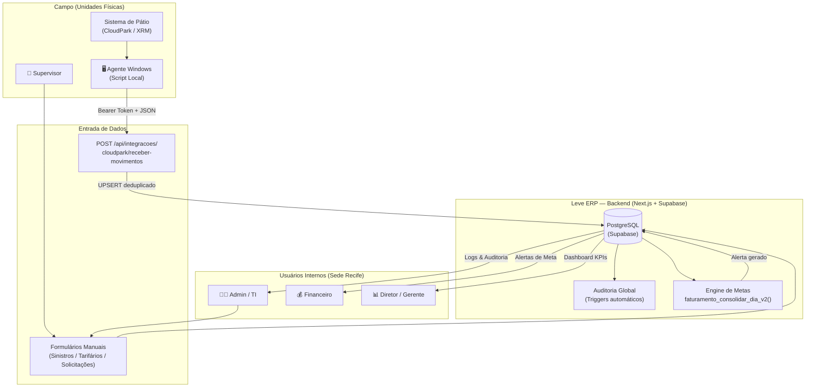

# Fluxos de Negócio: Leve ERP (PRISM)

## Diagrama Macro de Fluxos Interligados

---

## Fluxo 1 — Entrada de Dados via Agente Windows

**Ator:** Sistema Automatizado (Agente Python/Script + CloudPark API)
**Pré-condições:** Agente instalado na máquina local da unidade; `cloudpark_ativo = true` e `cloudpark_filial_codigo` configurado na operação correspondente; `CLOUDPARK_API_TOKEN` configurado no ambiente do ERP.

### Passo a passo

1. **Coleta local:** O agente roda a cada 15–30 minutos e consulta o banco local do sistema de pátio (CloudPark), extraindo tickets pagos no período.
2. **Montagem do payload:** Agrupa os itens em um JSON com `{ filial: <codigo_cloudpark>, items: [{payday, value, category, payment_method, description}] }`.
3. **Envio:** `POST https://dashboard.levemobilidade.com.br/api/integracoes/cloudpark/receber-movimentos` com `Authorization: Bearer <CLOUDPARK_API_TOKEN>`.
4. **Validação do token:** A API verifica se o `Bearer` corresponde a `CLOUDPARK_API_TOKEN`. Acesso negado → `401 Não autorizado`.
5. **Identificação da operação:** A API busca `operacoes WHERE cloudpark_filial_codigo = filial`. Operação não encontrada → `404` + log de erro em `faturamento_integracao_cloudpark_logs`.
6. **Log de recebimento:** Cria registro em `faturamento_integracao_cloudpark_logs` com `status = 'PROCESSANDO'`.
7. **Geração de hash:** Para cada item, calcula `SHA-256(filial|payday|value|category|payment_method|description)` → campo `integracao_hash`.
8. **UPSERT deduplicado:** `faturamento_movimentos.upsert(items, { onConflict: 'integracao_hash', ignoreDuplicates: true })` — itens já existentes são silenciosamente ignorados.
9. **Re-consolidação financeira:** Para cada data distinta no lote, chama `faturamento_consolidar_dia_v2(operacao_id, data)` via RPC do Supabase.
10. **Atualização de sincronização:** Grava `ultima_sincronizacao = NOW()` na operação.
11. **Fechamento do log:** Atualiza `status = 'COMPLETO'` (ou `'ERRO'` em caso de falha).

### Resultado esperado
`{ success: true, total_recebido: N, total_inserido: K, total_duplicado: N-K, operacao: "Nome da Operação" }`

### Pontos de falha conhecidos
- **Internet da unidade:** Se estiver offline, o agente deve fazer buffer local e reenviar em lote assim que reconectar — duplicatas serão bloqueadas pelo `integracao_hash`.
- **Token expirado/inválido:** Retorna 401 sem log detalhado no servidor.
- **`cloudpark_ativo = false`:** A API retorna 403 sem processar dados — configuração esquecida ao ativar nova unidade.
- **Consolidação RPC falha:** Os movimentos ficam gravados mas o resumo diário não é atualizado, causando divergência no dashboard de metas.

---

## Fluxo 2 — Acesso e Login do Usuário Interno

**Ator:** Qualquer colaborador interno com conta criada pelo TI.
**Pré-condições:** Cadastro do usuário criado com `ativo = true` e `status = 'ativo'`; usuário possui email e senha temporária fornecidos pelo TI.

### Passo a passo

1. **Acesso à URL:** Usuário digita `dashboard.levemobilidade.com.br` no browser.
2. **Redirecionamento:** O `middleware.ts` detecta ausência de sessão e redireciona para `/login`.
3. **Tela de login:** Exibição do formulário com campos email + senha no visual com identidade Leve.
4. **Submissão:** `POST /api/auth/signin` via NextAuth.
5. **`authorize()` no servidor:**
   a. Busca usuário por email na tabela `usuarios` via `createAdminClient()`.
   b. Verifica `ativo = true` e `status ≠ 'inativo'`. Falha → retorna `null` → NextAuth exibe erro na tela.
   c. Executa `bcrypt.compare(senha_digitada, senha_hash)`. Senha errada → `null`.
   d. Retorna `{ id, nome, email, perfil }`.
6. **Geração do JWT:** NextAuth gera token assinado com `AUTH_SECRET`, contendo `{ id, perfil }`. Duracao: **8 horas**.
7. **Cookie httpOnly:** Token armazenado em cookie seguro no browser do usuário.
8. **Redirect para `/dashboard`:** Usuário é levado ao painel principal com o layout filtrado pelo seu `perfil`.

### Resultado esperado
Usuário autenticado no dashboard com menu lateral exibindo apenas os módulos permitidos para seu perfil.

### Pontos de falha conhecidos
- **Usuário inativo:** Mensagem genérica de erro (sem distinguir se a conta existe ou a senha está errada — por segurança).
- **Senha temporal não trocada:** Não há força de troca automática — depende de comunicação manual do TI.
- **Alteração de perfil em sessão ativa:** A mudança de role só é refletida após o JWT expirar (máximo 8h).

---

## Fluxo 3 — Visualização e Análise de Operações

**Ator:** `supervisor`, `gerente_operacoes`, `administrador`, `diretoria`.
**Pré-condições:** Usuário autenticado; deve haver operações cadastradas e vinculadas ao seu perfil.

### Passo a passo

1. **Acesso a `/operacoes`:** Usuário clica em "Operações" no menu lateral.
2. **Carregamento:** `GET /api/operacoes` retorna lista filtrada por escopo do usuário (supervisor vê sua unidade; gerente vê suas operações; admin vê tudo).
3. **Visualização em cards:** Grid de cards exibindo: nome, bandeira (GPA/Assaí/Carrefour…), cidade/UF, supervisor responsável, total de vagas, status (ativa/inativa).
4. **Filtros aplicados:** Usuário pode filtrar por bandeira, UF, status, supervisor.
5. **Drill-down (Admin):** Em `/admin/operacoes`, `administrador` e `administrativo` acessam a tabela expandida com todos os campos: infraestrutura (vagas moto, cancelas, CFTV), escopo de pessoal (líderes, operadores), benefícios (cesta, ticket), dados de integração CloudPark.
6. **Edição:** Modal de edição abre formulário multi-seção. `PATCH /api/operacoes/[id]` salva alterações.
7. **Auditoria automática:** Trigger `trg_audit_operacoes` registra `UPDATE` em `auditoria_administrativa` com diff dos campos alterados.

### Resultado esperado
Gestor tem visibilidade atualizada de todas as unidades sob sua responsabilidade com capacidade de editar parâmetros operacionais.

### Pontos de falha conhecidos
- **Campo `slug` ou `sql_server` legado:** Exibe valores de sistemas antigos que podem estar desatualizados.
- **Operação sem supervisor vinculado:** Pode ocorrer se o supervisor for desativado sem reatribuição.

---

## Fluxo 4 — Fluxo Financeiro (Metas e Faturamento)

**Ator:** `financeiro`, `administrador`, `diretoria`.
**Pré-condições:** Dados de faturamento chegando via Agente (Fluxo 1); metas mensais cadastradas para as operações.

### Passo a passo

**4.1 — Acompanhamento de Metas**

1. **Acesso a `/admin/faturamento/metas`:** `GET /api/metas-faturamento` retorna metas + apurações consolidadas.
2. **Visualização:** `VirtualMetasTable` exibe lista de operações com % de atingimento e status de ritmo colorido: `no_ritmo` (verde), `levemente_atrasada` (amarelo), `critica` (vermelho).
3. **Detalhe por operação:** Clique em `/admin/faturamento/metas/[id]` — gráfico de linha mostrando faturamento acumulado vs. meta parcial esperada vs. projeção até fim do mês.
4. **Identificação de desvio:** Sistema detecta automaticamente quando o ritmo cai abaixo do limiar de tolerância e gera um `alerta_meta` com criticidade calculada.

**4.2 — Tratativa de Alertas**

5. **Alerta exibido:** `/admin/faturamento/alertas` lista alertas pendentes com criticidade (`baixa/media/alta/critica`).
6. **Abertura do modal:** `AlertaTratativaModal` permite ao financeiro registrar causa raiz, categoria da causa (`queda_movimento`, `falha_sincronizacao`, etc.) e ação corretiva.
7. **Submissão:** `POST /api/metas-faturamento/alertas/[id]/tratativa` → cria `tratativa_alertas_meta`, atualiza `status` do alerta para `em_analise`.

**4.3 — Dashboard de Faturamento**

8. **Acesso a `/admin/faturamento`:** Carrega `faturamento_resumo_diario` por operação/período.
9. **Filtros:** Selecionar mês, ano, operação específica.
10. **Tickets individuais:** `VirtualTicketsTable` renderiza tickets via `react-window` para performance em listas de milhares de registros.
11. **Exportação:** Download de CSV gerado no servidor com todos os movimentos do período.

### Resultado esperado
Financeiro tem visibilidade completa da performance de cada operação vs. meta, com capacidade de intervir em desvios via tratativas documentadas.

### Pontos de falha conhecidos
- **Sincronização atrasada do agente:** Meta pode aparecer como `critica` quando na realidade a operação faturou mas o agente não entregou os dados ainda.
- **Alerta gerado incorretamente:** Dias com fechamento antecipado ou feriados podem gerar alertas falsos positivos.

---

## Fluxo 5 — Gestão de Patrimônio

**Ator principal de escrita:** `ti`, `administrador`, `administrativo`.
**Ator de leitura:** `diretoria`, `gerente_operacoes`, `supervisor`, `financeiro`, `auditoria`.
**Pré-condições:** Operações cadastradas; categorias criadas em `/admin/patrimonio/categorias`.

### Passo a passo

**5.1 — Cadastro de Novo Ativo**

1. **Acesso a `/admin/patrimonio/novo`:** Formulário de cadastro.
2. **Preenchimento:** Código único, nome, categoria (TI/Facilities/Operacional/Veículo/Mobiliário/Outros), condição, status inicial, operação de alocação, responsável, valor de compra, data de garantia.
3. **Campos dinâmicos JSONB:** Campo `campos_especificos` permite atributos extras por categoria (ex: número de série para TI, placa para veículo).
4. **Submissão:** `POST /api/patrimonio` → INSERT em `patrimonios`; trigger registra em `auditoria_administrativa`.

**5.2 — Consulta e Monitoramento**

5. **Inventário em `/admin/patrimonio`:** Tabela com filtros por categoria, status, operação.
6. **Detalhe do ativo:** Tabs: Dados Gerais / Histórico de Alocação (`patrimonio_movimentacoes`) / Manutenções (`patrimonio_manutencoes`) / Vistorias (`patrimonio_vistorias`) / Anexos.

**5.3 — Atualização e Transferência**

7. **Edição:** Modal de edição `PATCH /api/patrimonio/[id]` — atualiza status, responsável, condição.
8. **Transferência de operação:** Registra em `patrimonio_movimentacoes` com operação origem, destino e motivo. Atualiza `operacao_id` no ativo.
9. **Manutenção:** Cria registro em `patrimonio_manutencoes` com tipo (Preventiva/Corretiva), prestador, custo, datas.
10. **Alertas automáticos:** `patrimonio_alertas` é populado quando garantia vence ou manutenção está pendente.

### Resultado esperado
Inventário atualizado em tempo real com rastreabilidade completa de localização e histórico técnico de cada ativo.

### Pontos de falha conhecidos
- **RLS parcial:** Tabelas de patrimônio têm RLS habilitado mas sem policies formais no banco — controle feito apenas na camada de API.

---

## Fluxo 6 — Monitoramento de Links de Internet

**Ator:** `ti`, `administrador`.
**Contexto:** Este módulo está acessível via `/admin/tecnologia-ia/links`. Monitora a conectividade das unidades em tempo real.

### Passo a passo

1. **Acesso ao Hub:** Usuário TI acessa `/admin/tecnologia-ia` → card "Links de Internet" (badge: Infra).
2. **Listagem de status:** A tela lista todas as unidades conectadas à rede Leve com indicadores de: status de link (Online/Offline/Degradado), latência, operadora contratada, data do último heartbeat.
3. **Identificação de falha:** Unidade offline aparece com badge vermelho.
4. **Ação de investigação:** TI abre ticket manual na Central de Solicitações para a unidade afetada.
5. **Integração de incidentes:** O incidente pode ser registrado em `central_solicitacoes` vinculado ao departamento de TI.

> **Nota:** O módulo de Links de Internet está listado como `href: '/admin/tecnologia-ia/links'` no hub, mas o backend de coleta de dados de uptime dos links opera via agente local nas unidades, separado do agente CloudPark de faturamento.

---

## Fluxo 7 — Monitoramento de TEF

**Ator:** `ti`, `administrador`.
**Contexto:** Os terminais de pagamento (TEF) das unidades são monitorados indiretamente via integração com o sistema de pátio. Não há módulo TEF dedicado no ERP atualmente — o monitoramento de transações TEF é capturado como `forma_pagamento` nos `faturamento_movimentos`.

### Passo a passo (via dados de faturamento)

1. **Dados coletados:** O agente CloudPark captura todas as transações incluindo `payment_method: "credito"` / `"debito"` / `"pix"`, que mapeiam movimentos TEF.
2. **Análise no dashboard:** Em `/admin/faturamento`, o financeiro/TI pode filtrar por `forma_pagamento` para isolar transações TEF e identificar quedas no volume.
3. **Alerta de anomalia:** Se o volume de pagamentos eletrônicos cair abruptamente vs. dias anteriores, o engine de alertas pode gerar um `alerta_meta` sinalizando possível falha de terminal.
4. **Abertura de chamado:** TI abre solicitação na Central via `/central-solicitacoes/nova` no departamento de TI com categoria "Equipamento".

> **Limitação atual:** Não há polling direto de status de terminais TEF no ERP. O monitoramento é indireto via análise de volume de transações. Um módulo TEF dedicado está no roadmap planejado.

---

## Fluxo 8 — Auditoria e Logs (Rastreamento pelo TI)

**Ator:** `ti`, `administrador`, `auditoria`.
**Pré-condições:** Triggers de auditoria ativados via `sp_ativar_auditoria_tabela()` nas tabelas críticas.

### Passo a passo

**8.1 — Investigação de Ação Suspeita**

1. **Acesso:** `/admin/auditoria` → `GET /api/auditoria` carrega `auditoria_administrativa` com paginação.
2. **Filtros de investigação:** Filtrar por `usuario_id`, `modulo` (ex: `usuarios`, `sinistros`), `criticidade` (`alta`, `critica`), `periodo`.
3. **Análise do diff:** Cada linha expandida mostra `dados_anteriores` e `dados_novos` em JSON formatado — permite ver exatamente o que foi alterado.
4. **Rastreio de IP:** Campo `ip_address` no log permite localizar a origem da requisição.

**8.2 — Monitoramento de Integração Control-XRM**

5. **Acesso:** `/admin/tecnologia-ia/logs-xrm` → `GET /api/control-xrm/logs`.
6. **Filtros:** Por `nivel` (ERROR/WARN/INFO), `status_execucao`, `etapa` (INÍCIO/EXTRAÇÃO/CARGA/FIM), `periodo`.
7. **Identificação de falha:** Log com `nivel = 'ERROR'` e `status_execucao = 'FALHA'` indica problema na execução noturna do ETL.
8. **Diagnóstico:** Campo `detalhes_json` contém o payload completo de diagnóstico para debugging.

**8.3 — Auditoria de Configurações**

9. **Acesso:** `/admin/configuracoes` → tab "Auditoria de Alterações".
10. **Log local:** Exibe apenas logs com `modulo = 'configuracoes'` do `auditoria_administrativa`, mostrando antes/depois de cada credencial alterada (valores sensíveis são mascarados).

### Resultado esperado
TI/Auditoria consegue reconstruir completamente qualquer ação realizada no sistema, identificar responsáveis e intervir em anomalias.

### Pontos de falha conhecidos
- **Alta criticidade não notificada:** Não há sistema de notificação automática (email/Slack) para eventos com `criticidade = 'critica'` — depende de monitoramento ativo.
- **Logs Control-XRM muito volumosos:** Sem política de retenção/arquivamento definida, a tabela `control_xrm_logs` pode crescer indefinidamente.

---

## Fluxo 9 — Gestão de Usuários (pelo TI)

**Ator:** `administrador`, `administrativo`.
**Pré-condições:** Ator tem perfil `administrador` ou `administrativo`; novo colaborador foi contratado e TI recebeu solicitação de acesso.

### Criação de Novo Usuário

1. **Acesso:** `/admin/usuarios` → botão "Novo Usuário".
2. **Formulário:** Preencher nome completo, email corporativo (`@levemobilidade.com.br`), senha temporária, perfil de acesso, telefone (opcional), gerente vinculado (para supervisores).
3. **Validação de perfil no servidor:** `POST /api/usuarios` verifica se o solicitante é `administrador` ou `administrativo` → 403 caso contrário.
4. **Hash de senha:** `bcrypt.hash(senha, 10)` — nunca armazenada em texto puro.
5. **INSERT em `usuarios`:** `{ nome, email, senha_hash, perfil, status: 'ativo', ativo: true }`.
6. **Comunicação ao usuário:** TI informa o novo colaborador por email/WhatsApp sobre email e senha temporária (processo manual).

### Edição de Perfil

7. **Edição:** Clicar em usuário existente → `PATCH /api/usuarios/[id]` para alterar `perfil`, `gerente_operacoes_id`, `status`.
8. **Efeito:** Novo perfil aplicado no próximo login do usuário (JWT atual expira em até 8h).

### Revogação de Acesso

9. **Desligamento imediato:** Setar `ativo = false` via toggle na tela → `PATCH /api/usuarios/[id]` com `{ ativo: false }`. Próxima tentativa de login bloqueada pelo `authorize()`.
10. **Sessão ativa:** JWT existente permanece válido até expirar (máximo 8h). Para revogação imediata, rotacionar `AUTH_SECRET` nas variáveis de ambiente (invalida todos os tokens simultaneamente).

### Resultado esperado
Usuário criado tem acesso imediato ao sistema na próxima confirmação de login, com visibilidade restrita ao seu perfil.

### Pontos de falha conhecidos
- **Senha temporária insegura:** TI pode usar senhas fracas para contas temporárias — sem validação de força de senha implementada na API.
- **Usuário sem gerente vinculado:** Supervisores sem `gerente_operacoes_id` não aparecem corretamente em listagens agrupadas.

---

## Fluxo 10 — Configurações do Sistema

**Ator:** `administrador`, `ti`.
**Pré-condições:** Acesso à rota `/admin/configuracoes`.

### Passo a passo

**10.1 — Gestão de Integrações**

1. **Acesso:** `/admin/configuracoes` → aba "Geral e Integrações".
2. **Carregamento:** `GET /api/configuracoes` retorna registros de `configuracoes_sistema`, separando por `categoria` (`google_drive`, `supabase`).
3. **Campos sensíveis:** Credenciais como `CLIENT_SECRET` e `REFRESH_TOKEN` são exibidas como `••••••••` por padrão — botão de olho para revelar.
4. **Edição:** Usuário altera valor no input e clica no botão Save inline → `PATCH /api/configuracoes` com `{ id, chave, valor, categoria }`.
5. **Auditoria automática:** Trigger registra diff do valor anterior vs. novo em `auditoria_administrativa`.
6. **Teste de conexão:** Botão "Testar Conexão" → `POST /api/configuracoes/test-connection` com `{ tipo: 'google_drive' | 'supabase' }` retorna resultado inline no card.

**10.2 — Aparência**

7. **Aba Aparência:** Permite selecionar Modo Claro ou Modo Escuro.
8. **Persistência:** Tema salvo no `localStorage` via `ThemeContext`. Aplicado automaticamente nos próximos acessos.

**10.3 — Auditoria de Configurações**

9. **Aba Auditoria:** Lista logs filtrados por `modulo = 'configuracoes'` com diff de antes/depois + IP de origem.

### Resultado esperado
TI consegue atualizar credenciais de integração de forma segura, validar a conexão imediatamente e rastrear todas as alterações com autor e IP.

### Pontos de falha conhecidos
- **`AUTH_SECRET` não configurável pela UI:** Esta variável crítica está em `ENV` — alteração exige acesso ao painel Vercel/servidor e causa invalidação de todas as sessões ativas.
- **Credenciais Supabase:** Alerta explícito na tela: "Alterar as chaves do Supabase incorretamente pode causar a queda imediata do sistema."
- **Sem rollback automático:** Se uma configuração inválida for salva, não há mecanismo de reversão automática — depende da aba de Auditoria para recuperar o valor anterior manualmente.
