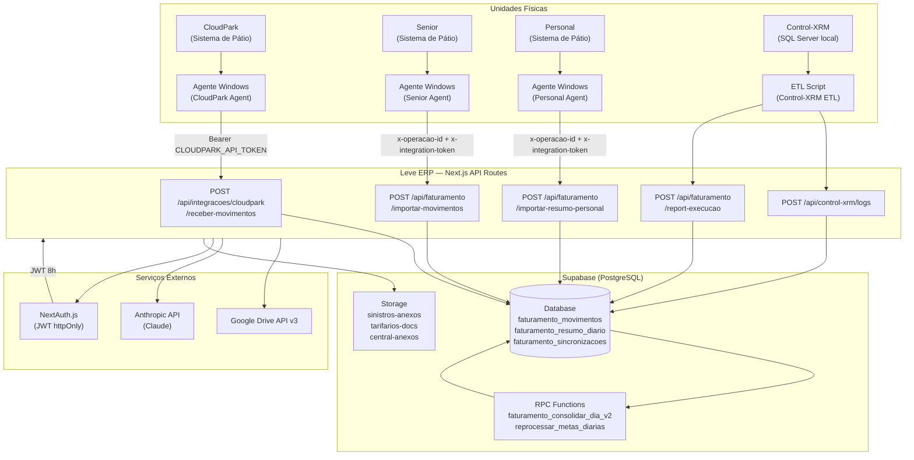

# Integrações e Agentes: Leve ERP (PRISM)

---

## 1. Agente Windows — Documentação Completa

### O que é e qual o papel no ecossistema

O Agente Windows é um **script local (Python ou executável)** que roda nas máquinas das unidades operacionais da Leve Mobilidade. Seu papel é extrair dados de receita dos sistemas de pátio instalados localmente e enviá-los ao Leve ERP via API REST HTTPS, fechando o ciclo do fluxo de faturamento descentralizado.

```
[Sistema de Pátio Local] → [Agente Windows] → HTTPS → [Leve ERP API] → [Supabase/PostgreSQL]
```

### Onde roda

- **Ambiente:** Máquina Windows local de cada unidade operacional.
- **Processo:** Executável ou script Python agendado via Windows Task Scheduler.
- **Conectividade:** Requer acesso à internet com destino `https://dashboard.levemobilidade.com.br`.

### Sistemas locais lidos

| Sistema | Identificador no código | Tipo de dado |
|---|---|---|
| **CloudPark** | `cloudpark` / `CLOUDPARK_AGENT` | Movimentos detalhados por ticket |
| **Senior** | `SENIOR_SYNC` / `api_agent` | Movimentos detalhados por ticket |
| **Personal** | `PERSONAL` / `API_PERSONAL_RESUMO` | Resumo diário agregado (sem tickets) |
| **Control-XRM** | Script independente | ETL via SQL Server direto |

### Modos de Integração

O campo `faturamento_modo_integracao` na tabela `operacoes` define qual endpoint o agente deve usar para cada unidade:

| Modo | Endpoint utilizado | Descrição |
|---|---|---|
| `movimentos_detalhados` (CloudPark/Senior) | `POST /api/faturamento/importar-movimentos` | Envia ticket a ticket |
| `cloudpark_agent` | `POST /api/integracoes/cloudpark/receber-movimentos` | Formato CloudPark nativo com hash SHA-256 |
| `personal_resumo_diario` | `POST /api/faturamento/importar-resumo-personal` | Envia apenas totalizadores diários |

### Dados Extraídos — Formato CloudPark/Senior (Movimentos Detalhados)

```json
{
  "movimentos": [
    {
      "ticket_id": "12345",
      "data_entrada": "2026-04-06T08:00:00",
      "data_saida": "2026-04-06T10:30:00",
      "valor": 25.00,
      "forma_pagamento": "credito",
      "tipo_movimento": "RECEITA",
      "origem_sistema": "CLOUDPARK"
    }
  ]
}
```

### Dados Extraídos — Formato Personal (Resumo Diário)

```json
{
  "data_referencia": "2026-04-06",
  "resumo": {
    "total_receita_original": 3500.00,
    "total_avulso_original": 2800.00,
    "total_mensalista_original": 700.00,
    "total_geral": 3500.00
  },
  "resumo_por_forma_pagamento": {
    "credito": 1500.00,
    "debito": 800.00,
    "pix": 1200.00
  },
  "resumo_por_tipo": { "avulso": 2800.00, "mensalista": 700.00 },
  "schema_version": "1.0.0",
  "agent_version": "2.1.0",
  "integration_type": "personal_resumo_diario"
}
```

### Autenticação do Agente

Dois mecanismos distintos em uso:

**Mecanismo 1 — token_integracao por operação (Senior/Personal):**
```
Headers:
  x-operacao-id:       <UUID da operação no Supabase>
  x-integration-token: <token único da operação em operacoes.token_integracao>
```
O servidor verifica `operacoes WHERE id = operacao_id AND token_integracao = token`.

**Mecanismo 2 — Bearer global (CloudPark):**
```
Headers:
  Authorization: Bearer <CLOUDPARK_API_TOKEN>
```
Token único de sistema — `dc952bbb65a31755a53a830233cfe452...`. Verificado contra a variável de ambiente `CLOUDPARK_API_TOKEN`.

### Deduplicação

| Integração | Chave de deduplicação | Estratégia |
|---|---|---|
| Senior/CloudPark (movimentos) | `(operacao_id, ticket_id)` UNIQUE | `upsert` com `onConflict: 'operacao_id, ticket_id'` — atualiza em re-envio |
| CloudPark nativo | `integracao_hash` (SHA-256) | `upsert` com `ignoreDuplicates: true` — ignora duplicatas |
| Personal (resumo) | `(operacao_id, data_referencia, origem_sistema)` | `upsert` UNIQUE — substitui resumo do dia |

### Tratamento de Falhas e Retry

- **Agente offline (internet da unidade):** O agente deve fazer buffer local e reenviar quando reconectar. Duplicatas serão ignoradas pelo sistema de deduplicação.
- **Purge do dia:** Header opcional `x-purge-today: true` limpa movimentos e resumos do dia atual antes de reinserir — util para correção de dados incorretos.
- **Chunking:** Agente envia em lotes de até 1000 registros por request para evitar timeout.
- **Business flag:** Após importação bem-sucedida, `operacoes.integracao_faturamento_ativa = true` é atualizado automaticamente.

### Logs do Agente no ERP

| Tabela | Propósito | Campos-chave |
|---|---|---|
| `faturamento_importacao_logs` | Log de cada lote importado | `operacao_id`, `quantidade_recebida`, `quantidade_inserida`, `status`, `tempo_execucao_ms` |
| `faturamento_sincronizacoes` | Heartbeat de execução do agente | `operacao_id`, `agente_id`, `status` (`SUCESSO`/`ALERTA`/`ERRO`), `tempo_execucao_segundos` |
| `faturamento_integracao_cloudpark_logs` | Específico CloudPark | `status` (`PROCESSANDO`/`COMPLETO`/`ERRO`) |

### Endpoint de Heartbeat

O agente pode reportar execuções independentemente de uploads via:

```
POST /api/faturamento/report-execucao
Body: {
  "operacao_id": "<UUID>",
  "agente_id": "LOCAL-SCRIPT",
  "status": "sucesso",
  "registros_processados": 150,
  "tempo_execucao_segundos": 12.5,
  "mensagem": "Execução concluída"
}
```

**Auth:** Sem autenticação de token neste endpoint (autenticação somente por `operacao_id` válido).

### Atualização e Redistribuição

- **Sem mecanismo de auto-update:** O agente deve ser atualizado manualmente em cada unidade.
- **Configuração local:** Cada instalação lê as variáveis de ambiente locais (arquivo `.env` ou `config.ini`) com os tokens da sua operação.
- **Página de configuração:** `/agente-config` (rota pública no ERP) serve como referência de configuração para o TI da unidade.

---

## 2. Integração Control-XRM (ETL de Faturamento Externo)

### O que é

Script Python/VBScript que roda em horário programado (noturno), conecta diretamente ao banco SQL Server do sistema Control-XRM (sistema legado de gestão de estacionamentos), extrai os registros de faturamento e os envia ao ERP.

### Fluxo de dados

```
[SQL Server local / VPN] → [Script Control-XRM ETL] → HTTPS → [Leve ERP API] → [Supabase]
```

### Endpoints utilizados pelo script Control-XRM

| Endpoint | Método | Propósito |
|---|---|---|
| `/api/faturamento/importar-movimentos` | `POST` | Envio dos movimentos extraídos |
| `/api/faturamento/report-execucao` | `POST` | Heartbeat de início e fim de execução |
| `/api/control-xrm/logs` | `POST` (via `log_tecnico` helper) | Logs estruturados de cada etapa |

### Logs Control-XRM no ERP

Tabela `control_xrm_logs` com campos:
- `nivel`: `INFO`, `WARN`, `ERROR`
- `etapa`: `INICIO`, `EXTRACAO`, `TRANSFORMACAO`, `CARGA`, `FIM`
- `status_execucao`: `SUCESSO`, `FALHA`, `PARCIAL`
- `detalhes_json`: payload completo da etapa para debugging

Visualizados em `/admin/tecnologia-ia/logs-xrm`.

---

## 3. Supabase — Serviços em Uso

### Database

- **Engine:** PostgreSQL 15 (via Supabase managed)
- **URL:** `https://ckgqmgclopqomctgvhbq.supabase.co`
- **Schema:** `public` (schema padrão de todas as tabelas)
- **Padrão de queries:** Supabase JS Client (`@supabase/supabase-js`) via `createClient()` e `createAdminClient()`.

**Funções RPC utilizadas:**
| Função | Chamada via | Propósito |
|---|---|---|
| `faturamento_consolidar_dia_v2(p_operacao_id, p_data)` | `supabase.rpc()` | Re-consolida resumo diário após ingestão de dados |
| `reprocessar_metas_diarias(p_meta_id)` | `supabase.rpc()` | Recalcula apurações diárias de uma meta |
| `sp_ativar_auditoria_tabela(tabela)` | SQL direto via migration | Instala trigger de auditoria automática |
| `fn_auditoria_global_automatica()` | Trigger automático | Captura INSERT/UPDATE/DELETE em tabelas auditadas |
| `fn_get_current_user_id()` | SQL interno | Retorna UUID do usuário do contexto de sessão |
| `fn_get_current_user_perfil()` | SQL interno | Retorna perfil do usuário para políticas RLS |

### Auth

- **Provider ativo:** `Email/Password` via `CredentialsProvider` do NextAuth (não usa Supabase Auth nativo).
- **Supabase Auth:** Não utilizado para autenticação de usuários humanos — apenas como infraestrutura de chaves JWT.
- **Service Role Key:** usada pelo `createAdminClient()` para operações privilegiadas no backend (bypassa RLS).
- **Chave Anon:** usada pelo `createClient()` para operações com RLS ativo (raro no projeto atual).

### Storage

**Buckets identificados no código:**
| Bucket | Propósito | Módulo |
|---|---|---|
| `sinistros-anexos` | Fotos e documentos de sinistros | Módulo Sinistros |
| `tarifarios-docs` | Documentos de referência para solicitações tarifárias | Módulo Tarifários |
| `central-anexos` | Anexos de chamados do Helpdesk | Central de Solicitações |

**Políticas de storage:** Protegidas via service role key no backend — nenhum upload direto do cliente (browser) sem passar pela API Route.

### Google Drive

Integração alternativa para upload de arquivos (especialmente do módulo Tarifários):
- **Biblioteca:** Google Drive API v3 via `googleapis` npm package.
- **Credenciais:** `GOOGLE_CLIENT_ID`, `GOOGLE_CLIENT_SECRET`, `GOOGLE_REFRESH_TOKEN`, `GOOGLE_REDIRECT_URI`.
- **Folder de destino:** `GOOGLE_DRIVE_FOLDER_ID`.
- **Configuração:** Gerenciada em `/admin/configuracoes` → card "Integração Google Drive" com teste de conexão inline.

### Edge Functions

Não há Edge Functions Supabase documentadas no código — toda a lógica de negócio é executada via Next.js API Routes no servidor Node.js (Vercel).

### Realtime

Não utilizado atualmente. Atualizações de dados são obtidas via polling (re-fetch manual ou refresh de página).

---

## 4. Automações de Notificação

A tabela `automacoes_catalogo` existe no banco (acessada via `GET /api/automacoes`) e serve como catálogo de automações disponíveis. O schema sugere preparação para automações via n8n/Evolution API, mas **não há implementação ativa de envio de WhatsApp documentada no código analisado**.

### Status atual
| Automação | Status |
|---|---|
| WhatsApp via Evolution API | 🔶 Planejado / Catálogo criado |
| Notificações de alertas de meta | 🔶 Planejado (alertas existem no banco, mas envio não implementado) |
| Email de alerta | ❌ Não implementado |
| Relatório automático por WhatsApp | 🔶 Planejado |

---

## 5. API Routes Internas Next.js

### Módulo: Autenticação
| Rota | Método | Propósito | Auth |
|---|---|---|---|
| `/api/auth/[...nextauth]` | `GET/POST` | Handler NextAuth (signin, signout, session) | Pública |

### Módulo: Integrações (Agente)
| Rota | Método | Propósito | Auth |
|---|---|---|---|
| `/api/integracoes/cloudpark/receber-movimentos` | `POST` | Recebe lote CloudPark via Bearer token global | Bearer `CLOUDPARK_API_TOKEN` |
| `/api/faturamento/importar-movimentos` | `POST` | Importa movimentos detalhados Senior/CloudPark via token por operação | `x-operacao-id` + `x-integration-token` |
| `/api/faturamento/importar-resumo-personal` | `POST` | Importa resumo diário Personal | `x-operacao-id` + `x-integration-token` |
| `/api/faturamento/report-execucao` | `POST` | Heartbeat de execução do agente local | `operacao_id` no body |

### Módulo: Faturamento
| Rota | Método | Propósito | Auth |
|---|---|---|---|
| `/api/faturamento` | `GET` | Lista movimentos e resumos por período/operação | Sessão |
| `/api/faturamento/ajustes` | `GET/POST/PATCH` | Ajustes manuais de valores | Sessão + `financeiro/admin` |
| `/api/faturamento/alertas` | `GET` | Lista alertas de faturamento | Sessão |
| `/api/faturamento/calendario` | `GET` | Dados de calendário para o gráfico de metas | Sessão |
| `/api/faturamento/templates` | `GET` | Templates de configuração de metas | Sessão |

### Módulo: Metas de Faturamento
| Rota | Método | Propósito | Auth |
|---|---|---|---|
| `/api/metas-faturamento` | `GET/POST` | Lista e cria metas | Sessão |
| `/api/metas-faturamento/[id]` | `GET/PATCH/DELETE` | CRUD de meta específica | Sessão + perfil |
| `/api/metas-faturamento/alertas` | `GET/PATCH` | Lista e atualiza alertas de metas | Sessão |

### Módulo: Controle XRM
| Rota | Método | Propósito | Auth |
|---|---|---|---|
| `/api/control-xrm/logs` | `GET/POST` | Lista e cria logs do ETL Control-XRM | Pública (POST agente) / Sessão (GET) |

### Módulo: Operações
| Rota | Método | Propósito | Auth |
|---|---|---|---|
| `/api/operacoes` | `GET/POST` | Lista e cria operações | Sessão |
| `/api/operacoes/[id]` | `GET/PATCH/DELETE` | CRUD de operação específica | Sessão + `admin/administrativo` |

### Módulo: Sinistros
| Rota | Método | Propósito | Auth |
|---|---|---|---|
| `/api/sinistros` | `GET/POST` | Lista e cria sinistros | Sessão + perfil |
| `/api/sinistros/[id]` | `GET/PATCH` | Detalhe e atualização de sinistro | Sessão + RLS |

### Módulo: Tarifários
| Rota | Método | Propósito | Auth |
|---|---|---|---|
| `/api/tarifarios` | `GET/POST` | Lista e cria solicitações | Sessão + perfil |
| `/api/tarifarios/[id]` | `GET/PATCH` | Detalhe e workflow de aprovação | Sessão + perfil |

### Módulo: Patrimônio
| Rota | Método | Propósito | Auth |
|---|---|---|---|
| `/api/patrimonio` | `GET/POST` | Lista e cadastra ativos | Sessão + perfil |
| `/api/patrimonio/[id]` | `GET/PATCH/DELETE` | CRUD de ativo | Sessão + perfil |
| `/api/patrimonio/alertas` | `GET` | Alertas de patrimônio | Sessão |
| `/api/patrimonio/categorias` | `GET/POST/PATCH/DELETE` | CRUD de categorias | Sessão + `admin/ti/administrativo` |

### Módulo: Central de Solicitações
| Rota | Método | Propósito | Auth |
|---|---|---|---|
| `/api/central-solicitacoes` | `GET/POST` | Lista e cria chamados | Sessão |
| `/api/central-solicitacoes/[id]` | `GET/PATCH` | Detalhe e atualização | Sessão |
| `/api/central-solicitacoes/config` | `GET/POST/PATCH` | CRUD de departamentos/categorias | Sessão + `admin/ti/administrativo` |

### Módulo: Colaboradores
| Rota | Método | Propósito | Auth |
|---|---|---|---|
| `/api/colaboradores` | `GET/POST` | Lista e cadastra colaboradores | Sessão + perfil |
| `/api/colaboradores/[id]` | `GET/PATCH/DELETE` | CRUD de colaborador | Sessão + perfil |

### Módulo: Usuários e Permissões
| Rota | Método | Propósito | Auth |
|---|---|---|---|
| `/api/usuarios` | `GET/POST` | Lista e cria usuários | Sessão + `admin/administrativo` |
| `/api/usuarios/[id]` | `GET/PATCH` | Edita usuário específico | Sessão + `admin/administrativo` |
| `/api/permissoes` | `GET/PATCH` | Matriz de permissões por perfil | Sessão + `admin/ti` |
| `/api/admin/perfis` | `GET/POST/PATCH` | CRUD de perfis do sistema | Sessão + `admin/ti` |
| `/api/admin/modulos` | `GET/PATCH` | Módulos do sistema | Sessão + `admin/ti` |
| `/api/admin/usuarios-perfil` | `GET/PATCH` | Gestão de vínculo usuário-perfil | Sessão + `admin/ti` |
| `/api/admin/rebuild-alerts` | `POST` | Força reprocessamento de alertas | Sessão + `admin` |

### Módulo: Auditoria e Configurações
| Rota | Método | Propósito | Auth |
|---|---|---|---|
| `/api/auditoria` | `GET` | Lista logs de auditoria | Sessão + `admin/auditoria/diretoria` |
| `/api/configuracoes` | `GET/PATCH` | Lê e atualiza parâmetros do sistema | Sessão + `admin/ti` |
| `/api/configuracoes/test-connection` | `POST` | Testa conexão com integrações | Sessão + `admin/ti` |

### Módulo: Automações e Utils
| Rota | Método | Propósito | Auth |
|---|---|---|---|
| `/api/automacoes` | `GET` | Catálogo de automações disponíveis | Sessão |
| `/api/utils` | `GET` | Utilitários internos | Sessão |
| `/api/test-metas` | `POST` | Endpoint de teste de metas (desenvolvimento) | Sessão + `admin` |

---

## 6. Variáveis de Ambiente

| Variável | Serviço | Obrigatória | Descrição |
|---|---|---|---|
| `NEXT_PUBLIC_SUPABASE_URL` | Supabase | ✅ Sim | URL do projeto Supabase (exposta ao browser) |
| `NEXT_PUBLIC_SUPABASE_ANON_KEY` | Supabase | ✅ Sim | Chave anônima (RLS ativo, exposta ao browser) |
| `SUPABASE_SERVICE_ROLE_KEY` | Supabase | ✅ Sim | Chave de serviço (bypassa RLS — NUNCA exposta ao browser) |
| `AUTH_SECRET` | NextAuth | ✅ Sim | Secret para assinar JWTs — rotacionar invalida todas as sessões |
| `NEXTAUTH_URL` | NextAuth | ✅ Sim | URL base da aplicação (ex: `https://dashboard.levemobilidade.com.br`) |
| `CLOUDPARK_API_TOKEN` | Agente CloudPark | ✅ Sim | Token Bearer partilhado com todos os agentes CloudPark |
| `GOOGLE_CLIENT_ID` | Google Drive | ⚠️ Condicional | Obrigatório se upload para Drive for usado |
| `GOOGLE_CLIENT_SECRET` | Google Drive | ⚠️ Condicional | Par do CLIENT_ID |
| `GOOGLE_REFRESH_TOKEN` | Google Drive | ⚠️ Condicional | Token de refresh OAuth2 para acesso à API |
| `GOOGLE_REDIRECT_URI` | Google Drive | ⚠️ Condicional | URI de callback OAuth2 |
| `GOOGLE_DRIVE_FOLDER_ID` | Google Drive | ⚠️ Condicional | ID da pasta de destino no Drive (padrão: `root`) |
| `ANTHROPIC_API_KEY` | IA / Claude | ⚠️ Condicional | Key para features de IA generativa (módulo Tecnologia & IA) |

> **⚠️ Segurança crítica:** `SUPABASE_SERVICE_ROLE_KEY`, `AUTH_SECRET` e `ANTHROPIC_API_KEY` **jamais** devem ser expostas ao browser ou commitadas sem criptografia. Trocar `AUTH_SECRET` invalida todas as sessões ativas no sistema.

---

## 7. Diagrama de Integrações


